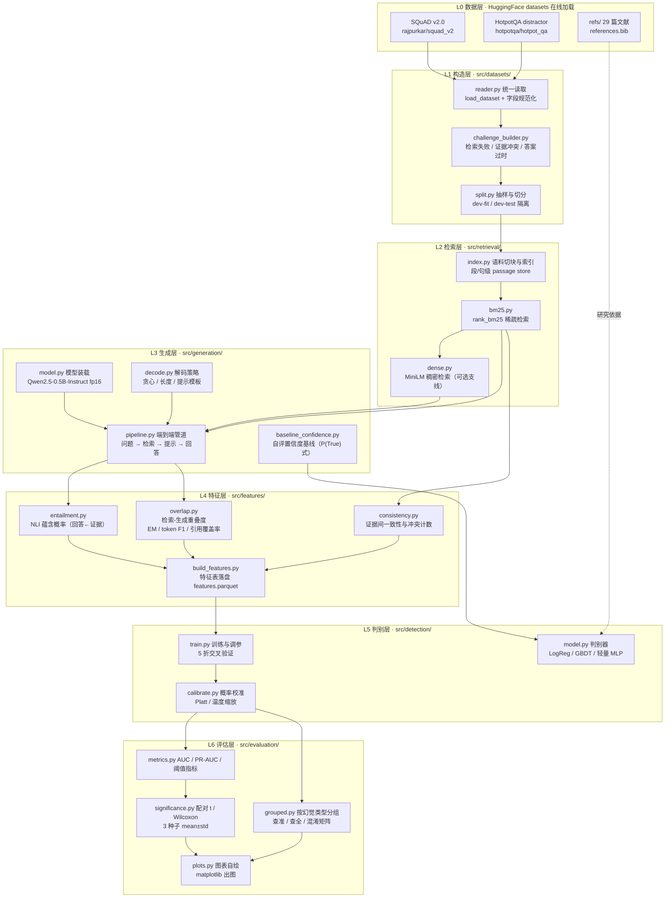
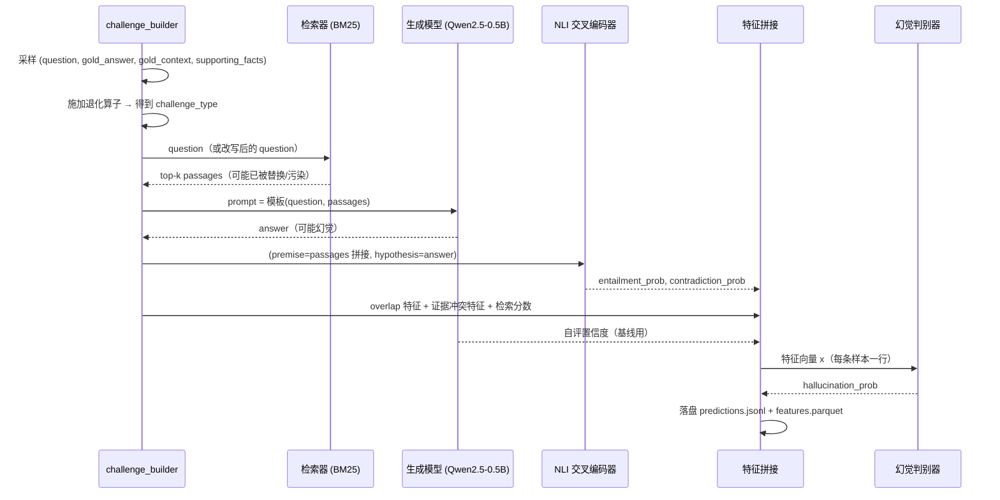
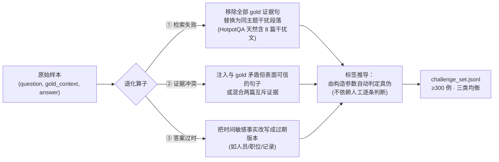
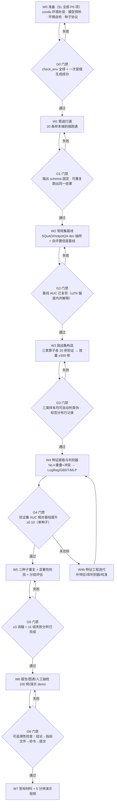
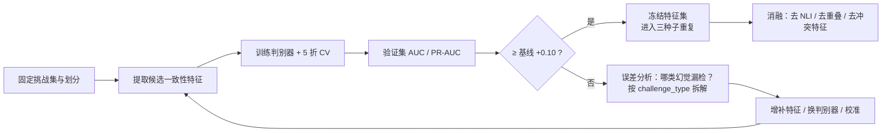
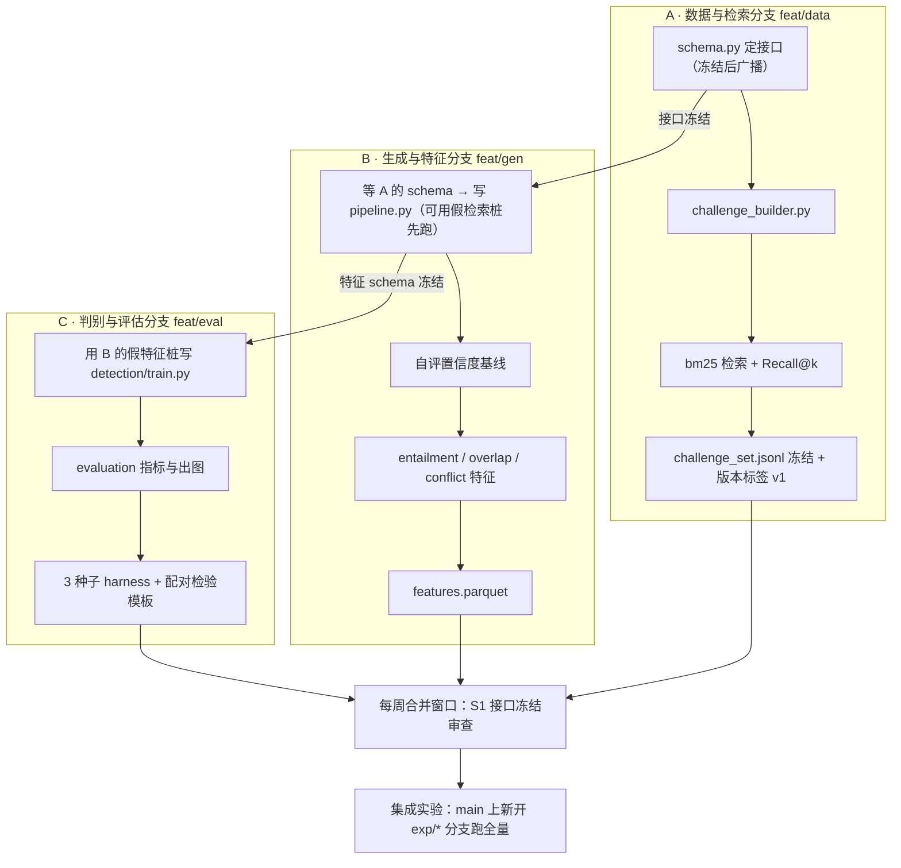

# 课题 C09 项目启动与实施指南

> 适用课题：《检索增强生成的幻觉检测与量化评估方法研究》（C09）
> 依据文档：[`C09_检索增强生成的幻觉检测与量化评估方法研究.md`](../C09_检索增强生成的幻觉检测与量化评估方法研究.md)（九要素）、[`要求.md`](../要求.md)（统一实验要求与交付物）
> 本指南第 1 节为开工准备，第 2-3 节为项目框架图与开发流程图，第 4 节为三人分工，第 5 节为验收对照表。
> 环境与依赖以仓库根目录 [`requirements.txt`](../requirements.txt) 为准，配置步骤见第 1 节。

---

## 1. 准备工作（P0 必须完成 / P1 尽快完成）

### 1.1 新建 conda 环境（Ubuntu / Windows 通用）

**全组新建统一环境 `rag-c09`（Python 3.10）**，不使用机器上已有的其他环境，也不使用工作区遗留的 `.venv/`。环境只由 `requirements.txt` 定义，每台机器照同一份清单重建，跨平台一致。

```bash
# Ubuntu / Windows 同一条命令（Windows 请在 "Anaconda Prompt" 中执行，或先 conda init powershell）
conda create -n rag-c09 python=3.10 -y
conda activate rag-c09
python -m pip install -U pip
python -m pip install -r requirements.txt
```

| 项 | 说明 |
|---|---|
| 环境名 | `rag-c09`（Ubuntu 路径 `~/miniconda3/envs/rag-c09`；Windows `%USERPROFILE%\miniconda3\envs\rag-c09`） |
| Python | 3.10（全组统一；3.11 亦可但不要混用） |
| 依赖来源 | 仓库根目录 [`requirements.txt`](../requirements.txt)，见 §1.2 |
| 安装体积 | 约 3–4 GB（torch 轮子占大头；Linux 另含 `nvidia-*-cu12` 运行时） |
| CUDA | torch 的 PyPI 轮子在 Linux 与 Windows 均自带 CUDA 构建，装完 `torch.cuda.is_available()` 应为 True；否则先更新 NVIDIA 驱动 |

**激活与解释器路径**（两个平台写法不同；脚本与报告中的命令一律用绝对路径，避免"当前是否已激活"的歧义）：

| 场景 | Ubuntu | Windows |
|---|---|---|
| 激活 | `source ~/miniconda3/etc/profile.d/conda.sh && conda activate rag-c09` | `conda activate rag-c09`（cmd / PowerShell） |
| 直接用解释器 | `~/miniconda3/envs/rag-c09/bin/python 脚本.py` | `%USERPROFILE%\miniconda3\envs\rag-c09\python.exe 脚本.py` |
| pip | `~/miniconda3/envs/rag-c09/bin/pip` | `%USERPROFILE%\miniconda3\envs\rag-c09\Scripts\pip.exe` |

**环境变量（跨平台对照）**——模型与数据集下载、离线复现都依赖它们（详见 §1.3、§1.4）：

| 变量 | 作用 | Ubuntu | Windows（PowerShell） |
|---|---|---|---|
| `HF_ENDPOINT` | 走 hf-mirror 镜像（**必设**） | `export HF_ENDPOINT=https://hf-mirror.com` | `$env:HF_ENDPOINT="https://hf-mirror.com"` |
| `HF_HOME` | 模型/数据集缓存目录 | `export HF_HOME=$HOME/.cache/huggingface` | `$env:HF_HOME="$env:USERPROFILE\.cache\huggingface"` |
| `PYTHONUTF8` | 避免 Windows 控制台中文乱码 | 一般无需 | `$env:PYTHONUTF8="1"` |
| 离线复现 | 预热后强制离线 | `export HF_HUB_OFFLINE=1` | `$env:HF_HUB_OFFLINE="1"` |

**四条约定**：① 不使用 `.venv/` 或任何旧环境；② 不向系统 Python / base 装包（`which pip` / `where pip` 必须指向 `rag-c09`）；③ 新增依赖**只改 `requirements.txt`** 并在组会报告，不要用 `conda install` 装 torch 系（会与 PyPI 轮子冲突）；④ 环境异常先跑 `scripts/check_env.py`，再排查。

**环境自检**：

```bash
python scripts/check_env.py --report results/env_report.json   # 退出码须为 0
python scripts/check_env.py --allow-missing                    # 装依赖之前：缺包仅告警
```

`scripts/check_env.py` 校验：是否处于 conda 环境（并提示约定名）、Python 版本、`requirements.txt` 逐条依赖（`==` 的锚点包严格比对）、CUDA/GPU/显存/bf16、`HF_ENDPOINT`；报告写入 `results/env_report.json`，作为实验记录的环境指纹（与 `seed`、`config_hash` 并列，见 §1.5）。

> 跨平台提示：项目路径**不要含中文或空格**（Windows 上尤其容易触发第三方库的编码与路径问题）。当前工作区路径含中文"文档"，若在 Windows 上协作，建议另置于纯 ASCII 路径。

### 1.2 依赖清单：`requirements.txt`

依赖只有一处定义——仓库根目录的 [`requirements.txt`](../requirements.txt)。跨平台差异（CUDA 轮子、平台专用包）都在该文件中说明，因此**不需要** `environment.yml` 之类的第二份清单。

| 分组 | 包 | 说明 |
|---|---|---|
| 数值锚点（`==` 固定） | `torch==2.10.0`、`torchvision==0.25.0`、`numpy==2.2.6` | **全组必须一致**，否则浮点结果不同、指标不可比 |
| 生成与检索 | `transformers>=4.56`、`sentence-transformers>=3.0`、`datasets>=2.20`、`huggingface_hub`、`sentencepiece`、`accelerate`、`rank_bm25` | RAG 管道、NLI 特征、数据在线加载 |
| 数据与统计 | `pyarrow`、`pandas`、`scipy`、`scikit-learn`、`PyYAML`、`tabulate` | 特征表落盘、指标与显著性检验 |
| 绘图与工具 | `matplotlib`、`tqdm`、`requests` | 图表自绘、进度条、元数据抓取 |
| 可选（默认注释） | `faiss-cpu`、`bitsandbytes` | 稠密检索索引、1.5B 4-bit 量化（Windows 支持有限，优先 Ubuntu） |

安装与镜像：

```bash
python -m pip install -r requirements.txt
# 未配置镜像的网络：
python -m pip install -r requirements.txt -i https://pypi.tuna.tsinghua.edu.cn/simple
# 需要显式指定 CUDA 版本（可选，两平台通用）：
python -m pip install torch==2.10.0 torchvision==0.25.0 --index-url https://download.pytorch.org/whl/cu128
```

跨平台注意事项：

- **不要写 `torch==2.10.0+cu128`** 这类本地版本号——PyPI 上没有该版本号，会直接安装失败；PyPI 的 Linux/Windows 轮子本身就是 CUDA 构建；
- `requirements.txt` **不列 `nvidia-*-cu12`**（Linux 专用，Windows 的 CUDA 运行时随 torch 轮子内置）与 **`triton`**（没有 Windows 轮子）；它们由 torch 按平台自动解析，写死会让另一个平台装不上；
- 若报"找不到匹配的版本"，先确认 Python 版本确为 3.10，再判断是否为镜像同步延迟（换官方源重试）；
- 环境里若同时存在 conda 与 pip 安装的同名包，**实际生效版本以 `import` 为准**（`python -c "import numpy;print(numpy.__version__)"`）。

### 1.3 模型准备与显存约束（`huggingface.co` 不可达时走镜像）

`HF_ENDPOINT=https://hf-mirror.com` 是必设项（设置方式见 §1.1 的跨平台对照表）；模型缓存目录由 `HF_HOME` 控制，**不要放进协作仓库**。

**按 4 GB 级显存选型**（本课题最硬的工程约束）：

| 角色 | 首选模型 | 体量 | 显存策略 | 许可 |
|---|---|---|---|---|
| 生成模型（主） | `Qwen/Qwen2.5-0.5B-Instruct` | 约 1.0 GB (fp16) | GPU fp16，batch=1–4 | Apache-2.0 |
| 生成模型（备/对照） | `Qwen/Qwen2.5-1.5B-Instruct` | 约 3.1 GB (fp16) | 必须 4-bit（`bitsandbytes`，建议在 Ubuntu 上跑）或 CPU 推理 | Apache-2.0 |
| 稠密检索（可选支线） | `sentence-transformers/all-MiniLM-L6-v2`（或 `BAAI/bge-small-en-v1.5`） | 约 0.09 GB | GPU 小 batch | Apache-2.0 / MIT |
| 稀疏检索（主管线） | `rank_bm25.BM25Okapi` | CPU 内存 | 纯 CPU | Apache-2.0 |
| NLI 蕴含特征 | `cross-encoder/nli-deberta-v3-xsmall`（备选 `-base`） | xsmall ≈ 0.14 GB / base ≈ 0.37 GB | GPU fp16 | MIT / Apache-2.0 |

显存预算经验法则（`max_new_tokens=128`、`batch=1`、`fp16`）：**峰值显存 ≈ 权重 + 0.3 GB 激活与 KV cache**。因此 0.5B 生成 + 0.14 GB NLI 可同驻一块 4 GB 显卡；1.5B 只能在 4-bit 下与 NLI 共存。解码统一用 `do_sample=False`（贪心），既省显存又是多种子复现的前提。

预热（两个平台同一条命令，**不用 shell heredoc**——Windows 不支持）：

```bash
python scripts/prefetch_assets.py            # 模型 + 数据集
python scripts/prefetch_assets.py --models   # 只下模型
```

### 1.4 数据：由代码在线加载（不手动下载）

SQuAD v2.0 与 HotpotQA 通过 HuggingFace `datasets` 按数据集标识在线加载，**不需要手动下载，也不需要在仓库里保存原始文件**；首次加载经 `HF_ENDPOINT` 镜像下载并缓存，之后离线可用。

```python
from datasets import load_dataset

squad  = load_dataset("rajpurkar/squad_v2", split="validation")                 # 11,873 问（含不可回答 5,945）
hotpot = load_dataset("hotpotqa/hotpot_qa", "distractor", split="validation")   # 7,405 问，含 supporting_facts
```

| 数据集 | 标识与配置 | 用途 |
|---|---|---|
| SQuAD v2.0 | `rajpurkar/squad_v2` | 抽取式问答，含不可回答问题（可作"证据缺失"类对照） |
| HotpotQA | `hotpotqa/hotpot_qa`，配置 `distractor` | 多跳问答，含句级 `supporting_facts` 与干扰段落——挑战子集构造的依据（见 §2.3） |

要点：

- **缓存位置**：`HF_HOME`（默认 `~/.cache/huggingface`；Windows `%USERPROFILE%\.cache\huggingface`），缓存目录不进协作仓库；
- **可复现**：加载时固定 `revision`（数据集提交哈希）并记入实验记录，避免上游更新导致样本漂移；
- **离线**：预热完成后设 `HF_HUB_OFFLINE=1`，实验阶段不再联网；
- **预热**：`python scripts/prefetch_assets.py --data`，脚本会打印各 split 的实际条数，可与上表核对；
- 工作区 `data/raw/` 下的本地副本与 `scripts/download_data.sh`、`scripts/verify_data.py` 仅作为**离线备选与历史校验记录**保留，不是数据获取主路径（`download_data.sh` 是 bash 脚本，Windows 需 WSL / Git Bash）。

文献（`refs/`）与数据集无关，仍用下面两条命令刷新：

```bash
python scripts/fetch_reference_metadata.py
python scripts/build_reference_docs.py
```

### 1.5 随机种子与可复现性协议（P0，验收硬指标）

课题要求"核心结论基于 ≥3 个随机种子并报告均值±标准差 + 显著性检验"，因此种子管理必须**先于**代码开发确定：

| 项 | 约定 |
|---|---|
| 主种子集合 | `SEEDS = [13, 42, 2024]`（3 个，报告中一律报 mean ± std） |
| 随机源覆盖 | `random`、`numpy.random`、`torch.manual_seed`、`torch.cuda.manual_seed_all`，以及 `transformers` 的 `set_seed` |
| 集中入口 | 唯一函数 `src/common/seeding.py::set_seed(seed)`，禁止在实验代码里散落 `np.random.seed` |
| 数据构造种子 | **独立**于模型种子（`challenge_builder` 用 `seed=1000+idx`），保证"换模型种子时挑战集不变"，消融才可比 |
| 抽样种子 | 常规测试集抽样、人工抽检 100 例的抽样，均显式传种子并记录到结果 JSON |
| 落盘留痕 | 每次实验输出 `results/metrics/<exp_id>.json`，必须含 `seed`、`config_hash`、`env`——其中 `env` 直接引用本次实验的 `results/env_report.json`（生成方式见 §1.1）；若结果最终提交到团队协作仓库，另记 `commit` |

### 1.6 工程规范

- 语言与风格：Python 3.10，`from __future__ import annotations`，模块级 docstring 必写（与本仓库既有两个脚本风格一致）；
- 配置外置：全部超参进 `configs/*.yaml`，代码里不写魔法数；`config_hash` 进结果文件；
- 日志：统一 `logging`，每次运行落 `results/logs/<exp_id>.log`；
- 第三方代码：>20 行的外部代码块必须在代码注释与报告中标注来源 + 许可证（`要求.md` 1.5 条第 2 款）。

---

## 2. 项目框架图

### 2.1 系统架构（分层）



### 2.2 一次问答样本的端到端数据流（含中间产物 schema）



中间产物字段契约（建议直接落为 `src/common/schema.py` 的 dataclass，三人依此对接，**禁止各自发明字段名**）：

```python
@dataclass(frozen=True)
class RAGSample:
    sample_id: str          # 全局唯一，如 "squad-dev-0042-c3"
    source: str             # "squad" | "hotpotqa"
    split: str              # "normal" | "challenge"
    challenge_type: str     # "none" | "retrieval_failure" | "evidence_conflict" | "outdated"
    question: str
    gold_answer: str        # 挑战样本经构造后的"真值答案"（可判定真伪）
    gold_context: list[str] # 支撑证据句
    is_hallucination: int   # 1 = 该样本下模型回答被判为幻觉（标签）

@dataclass(frozen=True)
class RetrievedPassage:
    rank: int
    title: str
    text: str
    score: float

@dataclass(frozen=True)
class Prediction:
    sample_id: str
    answer: str
    passages: list[RetrievedPassage]
    features: dict[str, float]   # entailment_prob / overlap_f1 / conflict_count / ...
    baseline_confidence: float   # 自评置信度基线
    hallucination_prob: float    # 本方法输出
```

### 2.3 挑战子集构造：三类退化算子（≥300 例）



三类算子的**可判定性**是课题成败关键，务必先在小样本（每类 20 例）上验证"真值标签能被自动推导"，再放量到 ≥300 例。

### 2.4 模块 ↔ 目录 ↔ 负责人映射

| 层 | 目录 | 负责人 | 交付物 |
|---|---|---|---|
| L1 构造层 | `src/datasets/` | A | `challenge_set.jsonl`（≥300 例）、`normal_set.jsonl`、构造日志 |
| L2 检索层 | `src/retrieval/` | A | BM25 索引、`Recall@k` 报告 |
| L3 生成层 | `src/generation/` | B | RAG 管道、自评置信度基线结果 |
| L4 特征层 | `src/features/` | B | `features.parquet`（含全部一致性特征） |
| L5 判别层 | `src/detection/` | C | 训练好的判别器 + 校准参数 |
| L6 评估层 | `src/evaluation/` | C | 指标表、分组评估、显著性报告、全部图表 |
| 公共 | `src/common/` | A（主） | `schema.py`、`seeding.py`、`io.py` — **接口以 A 为准，变更需全组确认** |

---

## 3. 开发流程图

### 3.1 主流程与阶段门禁



### 3.2 迭代循环（Phase 4 内部）



### 3.3 三人并行协作流



**并行关键**：接口（`schema.py`）与假数据桩必须在 W1 内冻结，否则三人会互相阻塞。分支与合并发生在**团队实际协作仓库**中，本工作区只承载课题文档、数据与实验产物，不使用 Git。A 冻结 schema 后，B 与 C 立刻用桩数据开工，不必等真实数据齐备。

### 3.4 周次排期（对齐教学周，开题后即执行）

```mermaid
gantt
    title C09 开发排期（W = 实验攻关期相对周次，对应教学周 6-11）
    dateFormat X
    axisFormat W%s
    section A 数据与检索
    schema 与接口冻结        :a1, 0, 1
    挑战集构造 v1（≥300例）   :a2, 1, 3
    检索器与 Recall@k        :a3, 1, 2
    挑战集版本迭代与冻结      :a4, 3, 3
    section B 生成与特征
    管道打通与冒烟测试        :b1, 0, 1
    常规集基线 + 自评置信度   :b2, 1, 2
    一致性特征提取            :b3, 2, 4
    特征工程消融              :b4, 4, 2
    section C 判别与评估
    评估框架与指标脚手架      :c1, 0, 2
    判别器训练与校准          :c2, 2, 2
    分组评估 + 3 种子 + 检验  :c3, 4, 2
    图表与报告素材            :c4, 5, 1
    section 全组
    中期检查材料（第 8 周）   :m1, 2, 1
    技术报告撰写              :m2, 6, 2
    答辩与演示                :m3, 8, 2
```



### 3.5 每周节奏

| 时点 | 动作 | 产出 |
|---|---|---|
| 周会（线上/线下 40 min） | 每人 3 分钟：上周结果（数字）→ 阻塞 → 本周计划 | 写入 `docs/实验记录.md` |
| 周中合并窗口（如周三晚） | 只合并"可运行 + 有验证"的分支；`main` 必须始终可跑通冒烟测试 | 提交记录 |
| 周会前 1 小时 | 各自在 `main` 上重跑冒烟测试，绿了才允许合并 | 冒烟测试日志 |

---

## 4. 三人团队分工

### 4.1 分工原则

1. **按"数据/管道 → 特征 → 判别评估"切分**，而非按"每人一个模型"，保证每人都能独立产出可验证的中间结果；
2. **接口所有权单一**：`src/common/schema.py` 由 A 维护，任何字段变更必须全组确认并同步改 `features.parquet` 的列说明；
3. **每人都有"可失败的实验"**：确保每人至少负责 1 组消融，天然满足"≥3 组消融"；
4. **互相审读**：报告章节交叉互审（A↔B、B↔C、C↔A），避免"自写自审"。

### 4.2 角色表

| 角色 | 代号 A —— 数据与检索 | 代号 B —— 生成与特征 | 代号 C —— 判别与评估 |
|---|---|---|---|
| **负责模块** | `src/datasets/`、`src/retrieval/`、`src/common/` | `src/generation/`、`src/features/` | `src/detection/`、`src/evaluation/` |
| **核心交付** | ① `challenge_set.jsonl` ≥300 例（三类均衡）② BM25 索引与 `Recall@k` ③ `schema.py` + 种子协议 ④ 构造参数说明文档 | ① 可复现 RAG 管道 ② 自评置信度基线结果 ③ `features.parquet`（蕴含/重叠/冲突特征全表）④ 特征定义说明 | ① 判别器（≥3 种对比）② 校准曲线 ③ 分组评估与混淆矩阵 ④ 3 种子显著性报告 ⑤ 全部图表 |
| **对应课题要素** | 数据来源、挑战子集构造 | 关键技术（RAG、NLI、一致性建模） | 实验分析、结论 |
| **主指标责任** | 挑战集标签正确性、`Recall@k` | 基线 AUC、特征可解释性 | **幻觉判别 AUC（相对基线 ≥+0.10）** |
| **消融责任** | 消融 1：三类算子分别去除/替换（看难度来源） | 消融 2：去 NLI 特征 / 去重叠特征 / 去冲突特征 | 消融 3：判别器替换（LogReg↔GBDT↔MLP）、校准影响 |
| **报告章节** | 数据与挑战集构造、检索器分析 | 方法：RAG 管道 + 一致性特征 | 实验与分析、消融与讨论、负结果分析 |
| **风险点** | 挑战样本真值无法自动判定 | 4 GB 显存下生成吞吐不足 | 训练集样本量小导致 AUC 方差大 |

### 4.3 WBS 任务分解（任务 → 负责人 → 依赖 → 验收）

| ID | 任务 | 负责 | 依赖 | 验收标准 |
|---|---|---|---|---|
| T0.1 | 新建 conda 环境 `rag-c09` + 安装 `requirements.txt` | A | — | `python scripts/check_env.py` 退出码 0（无 missing） |
| T0.2 | 模型与数据集预热 + 离线校验（§1.3、§1.4） | B | T0.1 | `prefetch_assets.py` 成功；断网可加载 3 个模型与 2 个数据集 |
| T0.3 | 统一 HF 镜像与离线开关（写入脚本头部与 README） | A | — | 各脚本在未联网时给出可读的镜像提示 |
| T0.4 | `schema.py` + `seeding.py` 冻结 | A | — | 三人脚本均 `import` 通过 |
| T1.1 | 数据 reader（按 §1.4 的标识在线加载 + 字段规范化） | A | T0.4 | 各 split 条数与官方划分规模一致 |
| T1.2 | BM25 检索 + `Recall@k` | A | T1.1 | dev 抽样 200 问上 `Recall@5` 有报告 |
| T1.3 | RAG 管道（20 条端到端） | B | T0.4, T1.2 | 同一 seed 连续两次结果逐字节一致 |
| T2.1 | 常规集基线 + 自评置信度基线 | B | T1.3 | `baseline_metrics.json` 含 AUC |
| T2.2 | 三类退化算子原型（各 20 例） | A | T1.1 | 人工抽检 20 例标签正确率 100% |
| T3.1 | 挑战集放量 ≥300 例 + 版本冻结 | A | T2.2 | 三类各 ≥80 例，标签分布写盘 |
| T3.2 | NLI 蕴含特征 | B | T1.3 | `entailment_prob ∈ [0,1]` 分布合理，与幻觉标签负相关 |
| T3.3 | 重叠度与冲突特征 | B | T1.3 | F1/EM/冲突计数落盘，列名与 schema 一致 |
| T4.1 | 判别器训练（LogReg/GBDT/MLP） | C | T3.1, T3.3 | 5 折 CV 结果表 + 校准曲线 |
| T4.2 | 分组评估（按三类） | C | T4.1 | 每组查准/查全/混淆矩阵 |
| T5.1 | 3 种子重复 + 配对 t / Wilcoxon | C | T4.1 | `metrics.csv` 为 mean±std，p 值落盘 |
| T5.2 | 三组消融 | A/B/C | T4.1 | 每组消融有独立结果目录 |
| T5.3 | 失败分析（≥1 组未达预期） | C | T5.1 | 明确写出哪类幻觉漏检 + 原因假设 + 验证 |
| T6.1 | 人工抽检 100 例一致性核验 | A+B | T5.1 | 抽检表 + Cohen's κ 或一致率 |
| T6.2 | 图表自绘（全部用 matplotlib 由结果重绘） | C | T5.1 | `results/figures/*.png`，脚本可重跑 |
| T6.3 | 演示 demo（5 min） | B | T6.2 | 输入问题→显示证据→幻觉判定与分数 |
| T7.1 | 技术报告（5000-8000 字） | 全组 | 全部 | 含负结果分析，逐条标注引用位置 |
| T7.2 | 答辩 PPT（10 min） | 全组 | T7.1 | 三人都能讲任意一页 |

### 4.4 共同职责与轮值

- **文献**：`refs/文献综述.md` 已生成底稿，三人各认领 10 篇做精读，负责在报告"相关工作"中补充该篇的精确表述与引用位置；
- **实验记录**：`docs/实验记录.md` 由每周主持人轮值（A→B→C）；
- **冒烟测试**：谁改 `main` 谁保证冒烟测试通过，破坏者负责修（先修后议）；
- **互审**：报告每章由非作者审读并留批注，答辩前做一次完整彩排。

---

## 5. 验收对照表（`要求.md` → 本项目落实）

| 要求（2.3 节） | 本项目落实方式 | 责任 |
|---|---|---|
| ≥3 项量化指标 | ① 幻觉判别 AUC ② PR-AUC ③ 阈值下查准/查全（+ 效率：单条样本推理延迟） | C |
| 分类任务报混淆矩阵与宏/微 F1 | `evaluation/grouped.py` 输出混淆矩阵 + 宏/微 F1（挑战集正负样本需保证不极端不平衡，构造时按 1:1 控制） | C |
| ≥3 随机种子 + mean±std + 配对 t/Wilcoxon（α=0.05） | `SEEDS=[13,42,2024]`，`significance.py` 同时输出 t 与 Wilcoxon | C |
| ≥3 组消融 | ① 三类算子去除/替换 ② 特征组去除（NLI/重叠/冲突）③ 判别器替换与校准 | A/B/C |
| ≥1 组失败分析 | 预期"答案过时"类样本证据本身正确但时序错误，一致性特征天然不敏感 → 作为预设的负结果方向 | C |
| 单卡 ≤12 GB、48 h 内完成 | 实测 3.68 GB 可用显存，0.5B fp16 + 贪心解码；全量实验时间预算见 §6 | 全组 |
| 图表自绘 | `evaluation/plots.py` 全部由 `results/metrics/` 重绘，禁止截图 | C |
| 数据再构造独立完成 | 挑战集构造算子 + 参数 + 种子随代码提交到协作仓库 | A |
| 文献 ≥15 篇、近 3 年 ≥8 篇 | 已有 29 篇（按 BibTeX 年份统计，2023 年及以后 16 篇），`refs/文献综述.md` 已全部引用 | 全组 |
| GB/T 7714—2025 著录 | `references.bib` → 报告参考文献表统一转换 | 全组 |

---

## 6. 风险与备选方案

| 风险 | 触发信号 | 备选方案 |
|---|---|---|
| 显存不足导致 OOM | 生成时 `CUDA out of memory` | 降 `max_new_tokens`（128→64）→ batch=1 → 生成模型换 0.5B → 逐层 CPU 卸载；**NLI 特征改用 GPU 分批、生成与 NLI 分时复用显存** |
| 挑战集真值难以自动判定 | 20 例原型人工抽检正确率 <90% | 退化为"半自动构造 + 规则判定 + 人工确认"，并如实把人工确认比例写进报告（属于"数据构造规范"，不扣分） |
| "答案过时"类样本无可靠来源 | SQuAD/HotpotQA 中时间敏感事实稀少 | 改用 Wikipedia 修订历史/明确日期事实改写，或把此类降为探索性分析并如实报告（要求允许负结果） |
| 特征对某类幻觉无效导致 AUC 提升 <0.10 | 单种子验证集 AUC 增益 <0.05 | 增强特征（引用覆盖率、检索-生成 span 对齐、多证据投票一致性）→ 加校准 → 若仍不达标，如实报告并在结论中给出"一致性特征敏感性边界"（课题结论要求本就是这个） |
| 生成吞吐不足 | 全量推理预估 >12 h | 常规集抽样规模下调（如 500→300），先保证挑战集全量；把抽样种子与规模写进报告 |
| 环境漂移 | 组员本地包版本不同（或操作系统不同）导致结果不一致 | 一律以 `requirements.txt` 为准；结果文件附带 `results/env_report.json`（含平台与包版本） |

---

## 7. 第一步执行清单（Day 1-2 可直接照做）

```bash
# ① 新建统一环境（Ubuntu 与 Windows 同一条命令；Windows 在 "Anaconda Prompt" 中执行）
conda create -n rag-c09 python=3.10 -y
conda activate rag-c09
python -m pip install -U pip
python -m pip install -r requirements.txt

# ② 设置镜像（Windows PowerShell: $env:HF_ENDPOINT="https://hf-mirror.com"；详见 §1.1）
export HF_ENDPOINT=https://hf-mirror.com

# ③ 环境自检：退出码必须为 0 才继续
python scripts/check_env.py --report results/env_report.json

# ④ 预热模型与数据集（首次联网，之后可离线；跨平台，不用 heredoc）
python scripts/prefetch_assets.py

# ⑤ 落目录骨架（Windows：用 New-Item -ItemType Directory 或 Python os.makedirs）
mkdir -p src/{common,datasets,retrieval,generation,features,detection,evaluation} \
         configs results/{metrics,logs,figures}
```

完成后即可进入 §3.1 的 **G0 门禁**：环境自检全绿 + 20 条样本冒烟生成成功。
